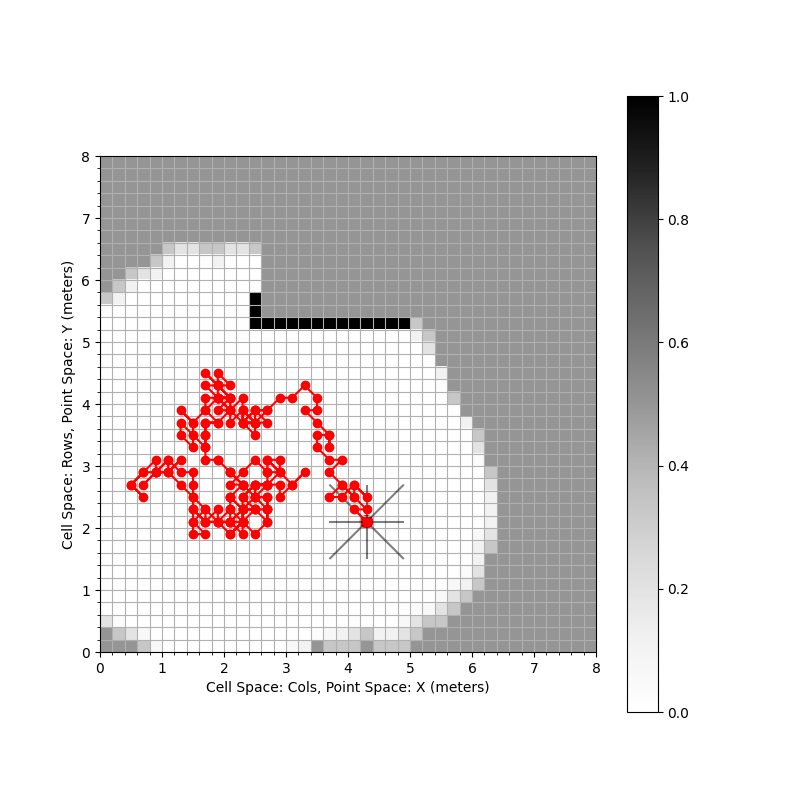
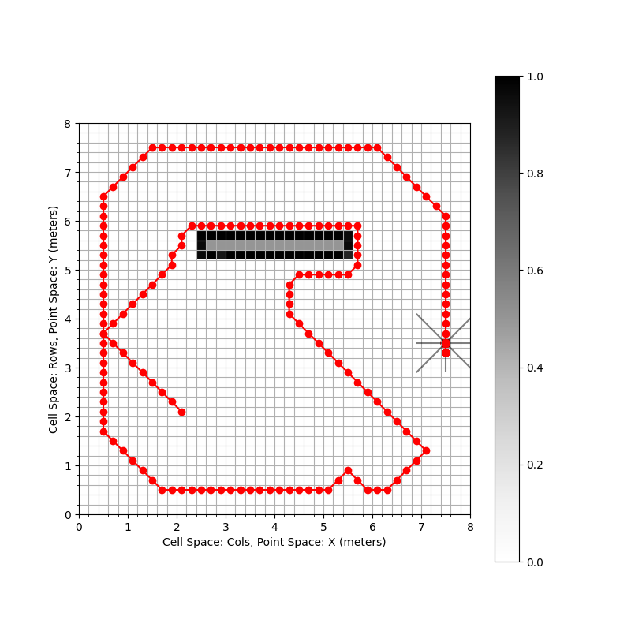

# 16-362 Assignment 4: Exploration

Goal: In this assignment, you will implement data structures and algorithms for
exploration using occupancy grid maps.

### Academic Integrity
1. Do not publicly share your solution (using GitHub or otherwise)
2. Collaboration is encouraged but you should write the final code on your own.

### 0. Setup
This repository uses Git LFS. Perform the following in a terminal on your computer.

```bash
git clone git@github.com:mral-cmu/assignment4-handout.git
cd assignment2-handout
git lfs install
git lfs pull
```

Now, create a python virtual environment.
```bash
python3.8 -m .venv venv
```
Source the environment
```bash
source .venv/bin/activate
```
You will need to install the following dependencies.
```bash
pip install cprint numpy matplotlib opencv-python scipy scikit-learn
```

We assume a point-shape robot with a size equal to one cell in the occupancy grid map. The state of
this robot is given by `PointRobotState` in `robot.py`. As in the mapping assignment, we assume that
the robot is equipped with a 360 degree field-of-view range sensor (e.g. 2D LiDAR) of a maximum usable
range `2.0m` and an angular resolution of `50` rays per scan. The robot can explore various environments
provided in the `test_data/` folder.

To set up this functionality correctly, we will rely on the solution to the mapping assignment (Assignment 2).
Please complete the following task as part of the setup.

> [!IMPORTANT]
> **Task 0.1 (0 points)**: Please copy your solutions for all functions from `mapper_py/data_structures/grid.py` in
> Assignment 2 into the file `mapper_py/data_structures/grid.py`. Similarly, copy solutions for
> `mapper_py/data_structures/sensor.py` and `mapper_py/mapper.py` in the respective files within this assignment.
> If you created some helper functions for your Assignment 2 solutions, make sure those are copied too.

> [!WARNING]
> Please do not directly copy and replace the files for the task above. Some helper functions have changed in
> the `mapper_py` folder provided within this assignment compared to the previous assignment.

> [!NOTE]
> If you could not get `traverse` function to work in Assignment 2,
> you are free to use any function from standard libraries. One idea can be to use
> [`skimage.draw.line`](https://scikit-image.org/docs/stable/api/skimage.draw.html#skimage.draw.line) from
> the `scikit-image` library. However, make sure you pass the `test_traversal` test from Assignment 2
> after fixing your `traverse` implementation (either on your own or through standard library functions).

To measure the exploration progress, it is beneficial to track how the entropy of the occupancy grid map
changes over time.

> [!IMPORTANT]
> **Task 0.2 (5 points)** Implement the functions `cell_entropy` and `map_entropy` in `Grid2D` class from
> `mapper_py/data_structures/grid.py`

> [!NOTE]
> To check your implementation for Task 0.2, you can use the script `entropy_test.py`. If the implementation is
> correct, you will see the output:
> ```
> [Task 0.2]: Full Credit.
> ```

## 1. A Simple Motion Primitive Library
> [!NOTE]
> No implementation required in this section. However, this information is important to read and it is
> crucial to understand when working on implementing the motion planners.

Let us equip our point robot with a simple library of motion primitives that enables the robot to move
in an 8-connected grid. For an illustration, consider this scenario:


Here, the robot is in the position shown in red in the occupancy grid. The motion primitives, shown by
red arrow, contain the information about the starting position and the direction in which the robot can move.
In this assignment, we constrain the robot to be able to move at most one cell along these directions.

This motion primitive library has been implemented for through the classes `SimplePrimitive`
and `PrimitiveLibraryGenerator` in `exploration.py`. Please read through the docstrings of these classes
to understand the provided functionality.

## 2. Take Random Actions and Avoid Collisions
Using the motion primitive library, let us create a simple motion planning setup for exploration.
Take a look at the class `ExplorationPlanner` in `exploration.py` and read through the docstrings.

The first task is to ensure safety by avoiding actions that may result in collision with the environment.

> [!IMPORTANT]
> **Task 2.1 (5 points)** Implement `is_feasible` function in `ExplorationPlanner`.

> [!NOTE]
> To check your implementation for Task 2.1, you can use `collision_test.py`. If the implementation is correct,
> you will see the output:
> ```
> [Task 2.1]: Full Credit.
> ```

Now that we have the capability to avoid collisions, let us enable the robot to take random actions while
avoiding collisions. Intuitively, this is the most "naive" way in which the robot can explore its surroundings.

> [!IMPORTANT]
> **Task 2.2 (5 points)** Implement `selection_policy` function in `ExplorationPlanner`.

> [!NOTE]
> It is difficult to quantitatively test this function since the selection policy is random. We will describe
> how this problem is graded later in the Frontier-based Exploration section.

For a qualitative evaluation, you can run
```
python explore_test.py -planner_type random
```

By default, the maximum timesteps given to the robot for exploration is 200.

You should see a confused robot trying to explore

https://github.com/mral-cmu/assignment4-handout/assets/7077226/2f327114-a62f-482c-b587-b78b0181fd32

and the final trajectory may look like



You will also see a plot for entropy of the explored map over time.

Clearly this is not a good exploration strategy. However, we now have infrastructure to test out
exploration planning algorithms. Let us start with implementing the frontier-based exploration method.

## 3. Frontier-based Exploration
Take a look at the class `FrontierPlanner`, which is derived from the `ExplorationPlanner` class.
We will override the method `selection_policy` to implement a new one. You can use any frontier-based exploration
method (ones studied in class or your own). We recommend using a simple strategy, such as following the closest
point on the frontier and using brute force search for frontier detection.

> [!IMPORTANT]
> **Task 3.1 (20 points)** Implement a frontier-based planner for exploration in the `selection_policy`
> within the `FrontierPlanner` class. Declare helper functions within the class as you need. The return type
> needs to be the same as in Task 2.2. You may need to override the `update_map` function to incorporate updating
> frontiers.

For a qualitative evaluation, you can run
```
python explore_test.py -planner_type frontier
```
You should see the robot exploring the environment much better than the random planner

https://github.com/mral-cmu/assignment4-handout/assets/7077226/700a7f5f-dcd1-4937-9d71-b615e79e3153

with the final trajectory of the robot being more exploratory



> [!IMPORTANT]
> You will receive full credit for Tasks 3.1, 2.2, and 2.1 if the following conditions are satisfied for at
> least one environment in `test_data/`:
> 1. The robot never collides with the occupied space
> 2. The robot never enters unknown space at any point during exploration
> 3. The robot explores faster in frontier-based case compared to the random case. In other words, the final entropy of the map should be lower in the frontier case compared to the random case for the same number of timesteps (default is 200)

You can run `exploration_comparison.py` to check if your solution passes these requirements for all the
environments in `test_data/`
```
python exploration_comparison.py
```
You are expected to receive full credit if you see the output
```
[Tasks 3.1, 2.2, and 2.1]: Full Credit.
```
> [!WARNING]
> Note that there is no possibility for partial credit in this part -- the frontier-based planner **must** perform
> better than random planner.

The available environments in `test_data/` are `charrow-map`, `office`, `maze-like`, and `simple-obstacle`
(default is `simple-obstacle`).

For visualization, you run frontier-based exploration with `explore_test` script in this manner for any
environment (`-env` option):
```
python explore_test.py -planner_type frontier -env maze-like
```
You might observe the robot getting "stuck" (if not for `maze-like` environment, one of the other environments).
While performance gains can be achieved with a more complicated motion pritimives design or hierarchical
methods, here we will use an information-theoretic exploration method to improve the exploration
performance further without changing any other parameters involved in exploration.

## 4. Information-Theoretic Exploration
In frontier-based exploration, intuitively, the robot is "pushing" the "boundary" (frontier) of the unknown
and free space. However, it does not reason about what it might gain beyond the boundary.

## 5. Multi-Robot Exploration
In this section we implement a Sequential Greedy Assignment (SGA) strategy for exploration using three robots.

## Grading with AutoLab
Assuming you are in this assignment directory, run this command after completing your solutions:

```
tar -C . -cvf handin.tar mapper_py explore_py
```

Submit `handin.tar` on Autolab.

Autolab will run tests on each function you implement and you will
receive a score out of 100. You may upload as many times as you like.
Note that we may regrade submissions after the deadline passes.

## References

## Author(s)
Kshitij Goel, Wennie Tabib
