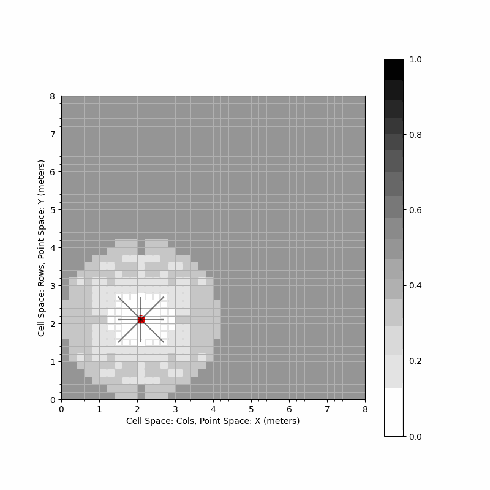

# 16-362 Assignment 4: Exploration

Goal: In this assignment, you will implement data structures and algorithms for
exploration using occupancy grid maps.

### Academic Integrity
1. Do not publicly share your solution (using GitHub or otherwise)
2. Collaboration is encouraged but you should write final code on your own.

### Setup
This repository uses Git LFS. Perform the following in a terminal on your computer.

```bash
git clone git@github.com:mral-cmu/assignment4-handout.git
cd assignment2-handout
git lfs install
git lfs pull
```

Now, create a python virtual environment.
```bash
python3.8 -m .venv venv
```
Source the environment
```bash
source .venv/bin/activate
```
You will need to install the following dependencies.
```bash
pip install cprint numpy matplotlib opencv-python
```

## Basic Collision Avoidance and Random Exploration



## Frontier-based Exploration


## Information-Theoretic Exploration

## Grading with AutoLab
Assuming you are in this assignment directory, run this command after completing your solutions:

```
tar -C . -cvf handin.tar mapper_py explore_py
```

Submit `handin.tar` on Autolab.

Autolab will run tests on each function you implement and you will
receive a score out of 100. You may upload as many times as you like.
Note that we may regrade submissions after the deadline passes.

## References

## Author(s)
Kshitij Goel, Wennie Tabib
